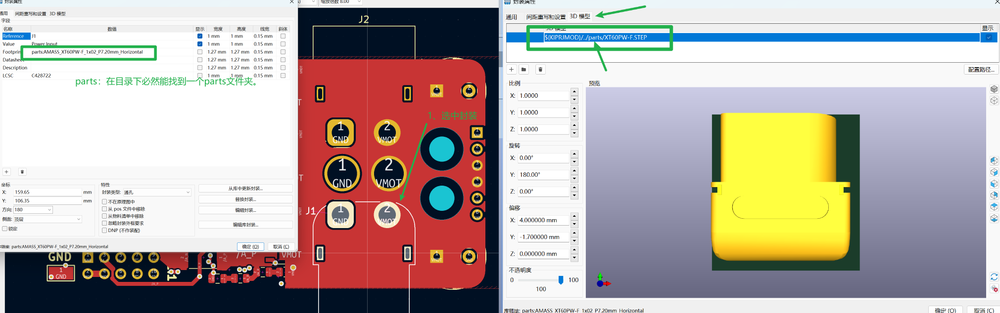

# KicadLib
## kicad库介绍
原理图库`.kicad_sym`
- 官方自带的元件库位置`D:\Program Files\KiCad\8.0\share\kicad\symbols`

- 设置>元件库位置        

- 封装库`.pretty`
    - 同上
- 3D模型库 `.3dshapes`
    - 同上

- 用户库
    - 自定义路径即可
- 从立创EDA/AD导入库

- 官方库介绍
[玩转 KiCad 元器件库！]`https://mp.weixin.qq.com/s/lFM7ZaMu_czCBVFxXZxhlQ`

## 库的获取

|网站|用户名|密码|网址|注意事项|
|-|-|-|-|-|
|traceparts(3D模型)|1252496768@qq.com|a1324.|[traceparts](https://www.traceparts.cn/zh/)||
|-|同上|同上|[3D模型](https://www.3dcontentcentral.com/Default.aspx)|网速较慢|
|迪威模型|微信||[迪威模型](https://www.3dwhere.com/)||
|Kicad工程获取|-|-|-|-|

### kicad获取库的方法
- 打开PCB编辑器，查看3D模型
- 选中想要的封装，按`E`编辑
- 获取库文件位置
    - 如下图所示
    
- 找到对应文件，复制到自己的库文件路径下
    - 重命名规则，kicad有自带的封装，没有3D文件，3D文件命名应和库文件保持一致。
## 插件的安装
- 参考链接:`https://mp.weixin.qq.com/s/uhDpBiPf1qUxG-Ta1UosKg`
## 快捷键/用户自定义设置

