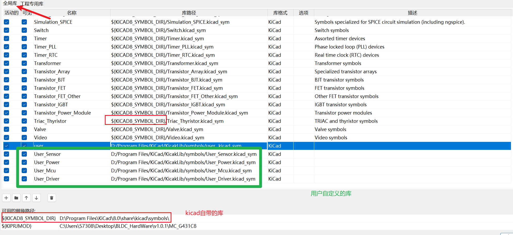

# KicadLib
## kicad库介绍
原理图库`.kicad_sym`
- 官方自带的元件库位置`D:\Program Files\KiCad\8.0\share\kicad\symbols`

- 设置>元件库位置        

- 封装库`.pretty`
    - 同上
- 3D模型库 `.3dshapes`
    - 同上

- 用户库
    - 自定义路径即可
- 从立创EDA导入库

## 3D模型的获取

|网站|用户名|密码|网址|注意事项|
|-|-|-|-|-|
|traceparts|1252496768@qq.com|a1324.|[traceparts](https://www.traceparts.cn/zh/)||
## 插件的安装
    参考链接:`https://mp.weixin.qq.com/s/uhDpBiPf1qUxG-Ta1UosKg`
## 快捷键/用户自定义设置